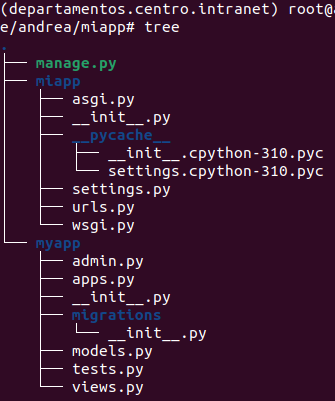
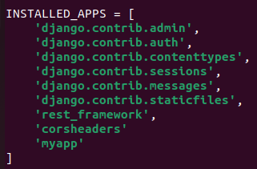
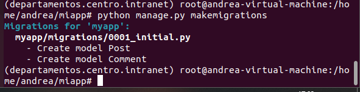
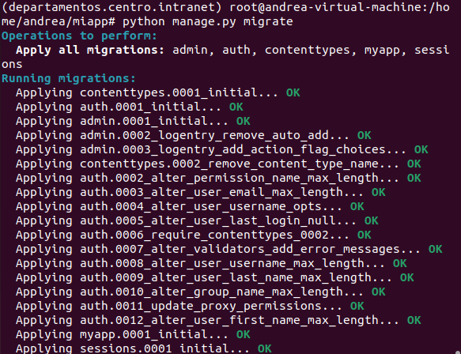
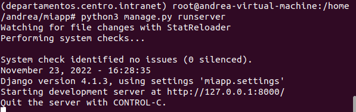
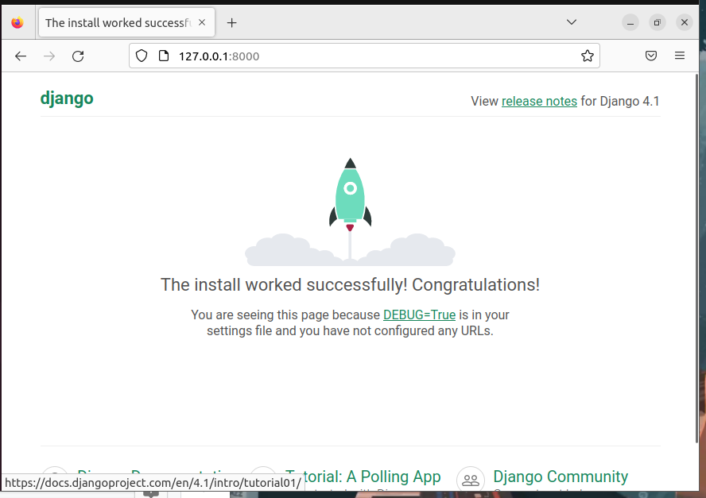

<h2>Instalación del servidor web apache. Usaremos dos dominios mediante el archivo hosts: centro.intranet y departamentos.centro.intranet (myapp). El primero servirá el contenido mediante wordpress y el segundo una aplicación en python.</h2>
Primero necesitaremos realizar varias configuraciones:
Instalamos apache:

```sudo apt update```

```sudo apt install apache2```

Para crear los dominios, primero, haremos ‘sudo nano /etc/hosts’, una vez dentro, añadiremos el dominio “centro.intranet” y "departamentos.centro.intranet” con la ip de nuestro equipo:


Crear nuestro fichero virtualhost:
Abrimos la terminal y creamos el fichero en el directorio con:

```sudo nano /etc/apache2/sites-available/centro.intranet.conf```

Dentro aparecerá:


Activamos el host:

```sudo a2ensite centro.intranet```

Ahora comprobamos que nuestro sitio está activado:

```ls /etc/apache2/sites-enabled/```


Agregamos la IP local y el nuevo dominio en el fichero HOST:

```sudo nano /etc/hosts```

añadimos la línea: '192.168.1.1 centro.intranet'

Recargamos Apache2: 

```sudo service apache2 reload```

Hacemos lo mismo con departamentos.centro.intranet.

*YA TENDRÍAMOS LOS DOS DOMINIOS CREADOS*.

<h3>WORDPRESS: centro.intranet</h3>
EL PRIMER DOMINIO ‘CENTRO.INTRANET’ LO SERVIREMOS EN WORDPRESS, que he previamente instalado, cuya explicación se encuentra en el [Ejercicio 3](EJERCICIOS/3.md)


LE DAMOS A INSTALAR:


Accedemos:

ASÍ SE VERÍA AL INICIAR SESIÓN EN CENTRO.INTRANET:


<h3>PYTHON: departamentos.centro.intranet</h3>
EL SEGUNDO DOMINIO ‘DEPARTAMENTOS.CENTRO.INTRANET’ LO SERVIREMOS EN UNA APP PYTHON: (mi aplicación se llama ‘myapp’ debido a que le puse ‘departamentos.centro.intranet al entorno virtual, en vez de a la aplicación).

Primero, instalamos Python con:

```sudo apt install software-properties-common -y```

```sudo add-apt-repository ppa:deadsnakes/ppa -y```

```sudo apt update```

```sudo apt install python3.9 -y```

Hecho esto, para configurar Virtual Host en Apache para ejecutar aplicaciones Python haremos lo siguiente:

Creamos un fichero, ‘departamentos.centro.intranet’ dentro del directorio /etc/apache2/sites-available/ y agregamos la configuración básica que se muestra a continuación a ‘departamentos.centro.intranet’:

```
<VirtualHost *:80>
    	DocumentRoot /var/www/departamentos.centro.intranet
        	WSGIDaemonProcess departamentos.centro.intranet user=www-data group=www-data processes=1 threads=5 python-path= /var/www/departamentos.centro.intranet
        WSGIScriptAlias / /var/www/departamentos.centro.intranet /departamentos.centro.intranet/wsgi.py
        <Directory /var/www/departamentos.centro.intranet >
                WSGIProcessGroup departamentos.centro.intranet  
                WSGIApplicationGroup %{GLOBAL}
                Require all granted
        </Directory>
        ErrorLog \${APACHE_LOG_DIR}/djangoapp-error.log
        CustomLog \${APACHE_LOG_DIR}/djangoapp-access.log combined
</VirtualHost>
```

Lo siguiente sería habilitar el sitio virtual recién creado con:

```sudo a2ensite departamentos.centro.intranet```

Deshabilitamos el sitio virtual que viene por omisión en Apache:

```sudo a2dissite 000-default.conf```

Reiniciamos apache2:

```sudo service apache2 restart```

Para crear un entorno virtual en Python 3 ejecutaremos la siguiente orden en un emulador de terminal:

```python3 -m venv departamentos.centro.intranet```

Para comenzar a trabajar en nuestro entorno virtual en Python 3, tenemos que ejecutar la siguiente orden:

```source departamentos.centro.intranet/bin/activate```


Instalamos la estructura de Django:

```pip install django djangorestframework django-cors-headers```

Ahora empezaremos a crear nuestro proyecto en este servidor virtual, generaremos el proyecto Django utilizando las siguientes comandos y utilidades:

```django-admin startproject miapp```

Dentro del proyecto ‘miapp’ crearemos la app ‘myapp’ con:

```python manage.py startapp myapp```

Con el comando tree podemos ver la estructura del proyecto:



Lo siguiente será entrar en settings.py, donde añadiremos ‘rest_framework’, ‘corsheaders’ y nuestra app ‘myapp’  dentro de ‘INSTALLED_APPS’.



Después añado en ‘MIDDLEWARE', ‘corsheaders.middleware.CorsMiddleware’.

Debemos empaquetar los cambios de nuestro modelo en archivos de migración individuales usando:

```python manage.py makemigrations```



Se habrán añadido dos nuevos elementos en ‘migrations’: __pycache__ y 0001_initial.py.

Para ver qué sentencias SQL se ejecutarán al hacer las migraciones, usamos el siguiente comando:

```python manage.py sqlmigrate myapp 0001_initial```


Ahora realizaremos las migraciones para que se apliquen a nuestra base de datos MySQL con:

```python manage.py migrate```



Habremos aplicado con éxito las migraciones.

Crearemos una nueva base de datos.

```CREATE DATABASE django;```

Un nuevo usuario y su contraseña:

```CREATE USER django_user’@'localhost' IDENTIFIED BY 'superpassword';```

Y le damos los permisos necesarios:

```GRANT ALL ON django.* to ‘django_user’@'localhost';```

Iniciamos el servidor con 

```python3 manage.py runserver```



Para ejecutar la app creada iremos al navegador. Mi app se ejecuta desde http://127.0.0.1:8000.

Nos saldrá la siguiente página:



Ya estaría creada y en funcionamiento mi aplicación python.

