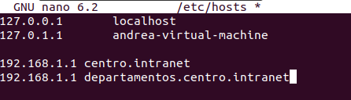
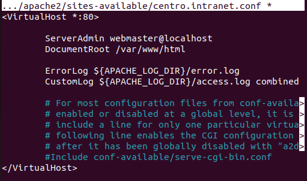
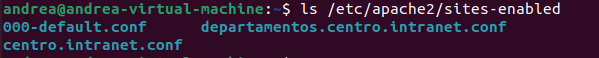
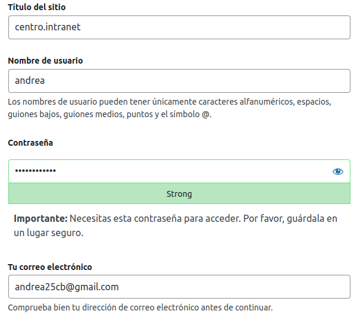
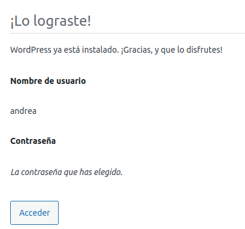
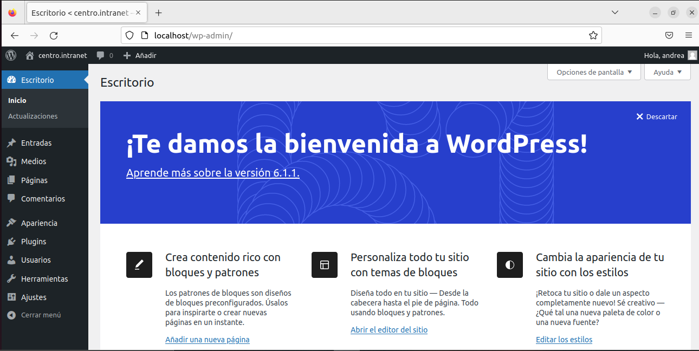
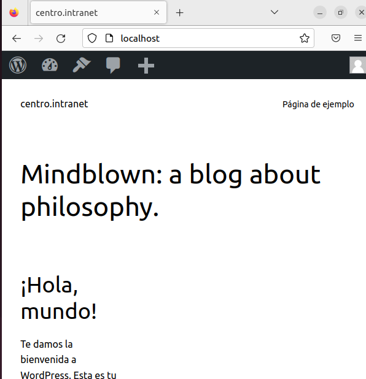

<h2>Instalación del servidor web apache. Usaremos dos dominios mediante el archivo hosts: centro.intranet y departamentos.centro.intranet (myapp). El primero servirá el contenido mediante wordpress y el segundo una aplicación en python.</h2>
Primero necesitaremos realizar varias configuraciones:
Instalamos apache:

```sudo apt update```

```sudo apt install apache2```

Para crear los dominios, primero, haremos ‘sudo nano /etc/hosts’, una vez dentro, añadiremos el dominio “centro.intranet” y "departamentos.centro.intranet” con la ip de nuestro equipo:



Crear nuestro fichero virtualhost:
Abrimos la terminal y creamos el fichero en el directorio con:

```sudo nano /etc/apache2/sites-available/centro.intranet.conf```

Dentro aparecerá:



Activamos el host:

```sudo a2ensite centro.intranet```

Ahora comprobamos que nuestro sitio está activado:

```ls /etc/apache2/sites-enabled/```




Agregamos la IP local y el nuevo dominio en el fichero HOST:

```sudo nano /etc/hosts```

añadimos la línea: '192.168.1.1 centro.intranet'

Recargamos Apache2: 

```sudo service apache2 reload```

Hacemos lo mismo con departamentos.centro.intranet.

*YA TENDRÍAMOS LOS DOS DOMINIOS CREADOS*.

<h3>WORDPRESS: centro.intranet</h3>
EL PRIMER DOMINIO ‘CENTRO.INTRANET’ LO SERVIREMOS EN WORDPRESS, que he previamente instalado, cuya explicación se encuentra en el [Ejercicio 3](EJERCICIOS/3.md)



LE DAMOS A INSTALAR:



Accedemos:

ASÍ SE VERÍA AL INICIAR SESIÓN EN CENTRO.INTRANET:





<h3>PYTHON: departamentos.centro.intranet</h3>
EL SEGUNDO DOMINIO ‘DEPARTAMENTOS.CENTRO.INTRANET’ LO SERVIREMOS EN UNA APP PYTHON:

Primero, instalamos Python con:

```sudo apt install software-properties-common -y```

```sudo add-apt-repository ppa:deadsnakes/ppa -y```

```sudo apt update```

```sudo apt install python3.9 -y```

Instalamos mod_wsgi en Apache, lo haremos instalando el paquete libapache2-mod-wsgi:

```sudo apt-get install libapache2-mod-wsgi-py3```

* Luego crearemos la estructura de directorios para nuestra aplicación:

(Debemos tener un directorio destinado a montar toda la aplicación, 'departamentos.centro.intranet')

Dentro de este directorio, vamos a dividir su arquitectura:

Destinada al almacenaje de nuestra aplicación Python pura (será un directorio privado, no servido):

```mkdir /etc/apache2/sites-available/departamentos.centro.intranet/mypythonapp```

Destinada a servir la aplicación (directorio público servido) en el cuál solo almacenaremos archivos estáticos:

```mkdir /etc/apache2/sites-available/departamentos.centro.intranet/public_html```

Para almacenar los logs de errores y accesos a nuestra Web App:

```mkdir /home/yo/curso-python/trunk/python-web/logs```


* El siguiente paso será crear un controlador para la aplicación:

*Todas las peticiones realizadas por el usuario serán manejadas por un único archivo, que estará almacenado en nuestro directorio mypythonapp.* 

<h4>Dentro de controller.py escribimos:</h4>

```echo '# -*- coding: utf-8 -*-' > mypythonapp/controller.py```

Dicho módulo, solo se encargará de definir una función, que actúe con cada petición del usuario. Esta función, deberá ser una función WSGI aplicación válida. Esto significa que:

* Deberá llamarse 'application'.
* Deberá recibir dos parámetros: 'environ', del módulo os, que provee un diccionario de las peticiones HTTP estándar y otras variables de entorno, y la función 'start_response', de WSGI, encargada de entregar la respuesta HTTP al usuario. 

```
def application(environ, start_response): 
        # Genero la salida HTML a mostrar al usuario 
        output = "<p>Bienvenido a mi <b>PythonApp</b>!!!</p>" 
        # Inicio una respuesta al navegador 
        start_response('200 OK', [('Content-Type', 'text/html; charset=utf-8')]) 
        # Retorno el contenido HTML 
        return output
   ```
   

Lo siguiente que haremos será <b>configurar el VirtualHost<b>:

<b>public_html</b> será la encargada de redirigir todas las peticiones públicas del usuario, hacia nuestro front controller. Y la variable que se encargue de esto, será el alias WSGIScriptAlias:
    
```sudo nano /etc/apache2/sites-available/departamentos.centro.intranet```

Una vez allí, escribimos el contenido del nuevo virtual host:

```
<VirtualHost *:80> 
  ServerName departamentos.centro.intranet

  DocumentRoot /etc/apache2/sites-available/departamentos.centro.intranet/public_html 
  WSGIScriptAlias / /etc/apache2/sites-available/departamentos.centro.intranet/mypythonapp/controller.py 
  ErrorLog /etc/apache2/sites-available/departamentos.centro.intranet/logs/errors.log 
  CustomLog /etc/apache2/sites-available/departamentos.centro.intranet/logs/access.log combined 

  <Directory /> 
    Options FollowSymLinks 
    AllowOverride All 
  </Directory> 
</VirtualHost>
```

Lo siguiente sería habilitar el sitio virtual recién creado:

```sudo a2ensite departamentos.centro.intranet```

Reiniciamos apache2:

```sudo service apache2 restart```

Habilitamos el sitio en nuestro host: sudo nano /etc/hosts y allí agregamos la siguiente línea: 
    '127.0.0.1 departamentos.centro.intranet'

A partir de ahora, si abrimos nuestro navegador Web e ingresamos la url http://departamentos.centro.intranet veremos la frase: "Bienvenido a mi PythonApp".
