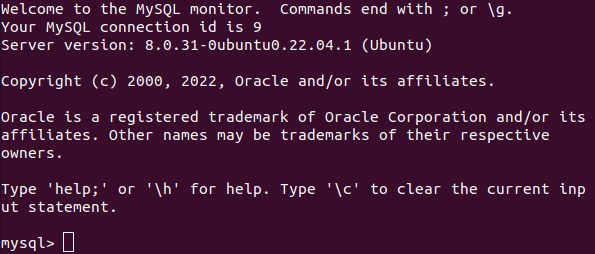
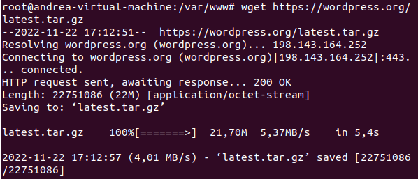
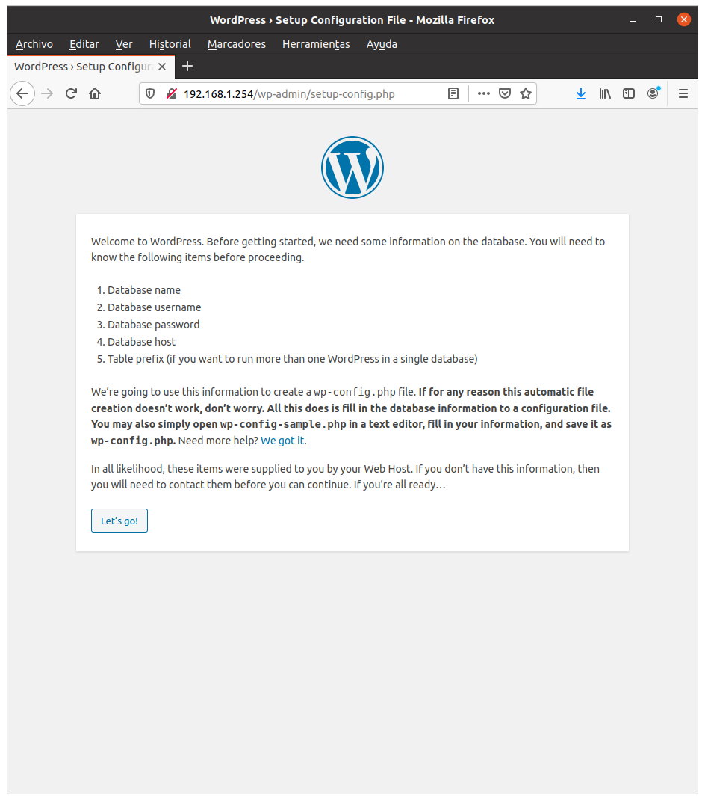
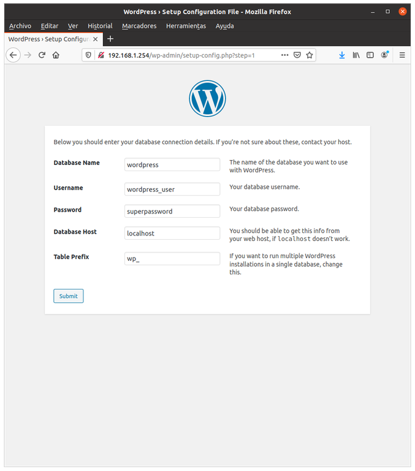

<h2>Instala y configura wordpress</h2>
Comenzaremos instalando PHP con las extensiones necesarias para Wordpress y MySQL, escribimos:

```apt update && apt install mysql-server php-fpm php-common php-mbstring php-xmlrpc php-soap php-gd php-xml php-intl php-mysql php-cli php-ldap php-zip php-curl```

Después conectamos con MySQL:

```mysql -u root```



Definimos la base de datos wordpress:

```CREATE DATABASE wordpress;```

Declaramos que wordpress_user podrá acceder utilizando la contraseña superpassword:

```CREATE USER 'wordpress_user'@'localhost' IDENTIFIED BY 'superpassword';```

Le concedemos todos los privilegios al usuario wordpress_user sobre la BBDD wordpress y cerramos la sesión de MySQL:

```GRANT ALL ON wordpress.* to 'wordpress_user'@'localhost';```

Salimos de la consola con ‘exit’.

<h4>Descarga de Wordpress:</h4>
Cambiamos el directorio de trabajo a /var/www para descargar y desarchivar Wordpress:

```cd /var/www```

```wget https://wordpress.org/latest.tar.gz```



```tar xzf latest.tar.gz```

Con lo siguiente, tendremos en ‘/var/www/html’ la página por defecto de Apache y en ‘/var/www/wordpress’ la aplicación que hemos descargado:

```mv html html-original```

```mv wordpress html```

```chown -R www-data html```

Los últimos pasos de la instalación se pueden hacer en el navegador; escribimos: 

```wp-admin/setup-config.php```




