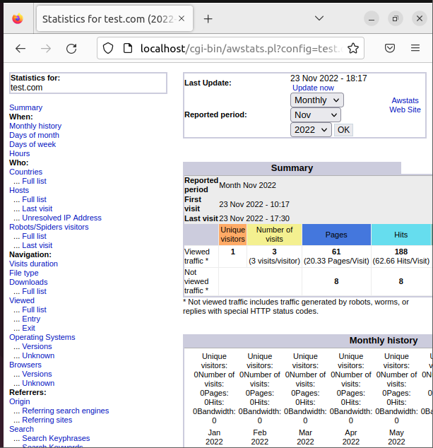

<h2>Instala y configura awstat</h2>

Instalamos con: 

```sudo apt-get install awstats```

Habilitamos el módulo CGI en Apache: 

```sudo a2enmod cgi```

Reiniciamos Apache: 

```sudo /etc/init.d/apache2 restart```

Para configurar AWStats, crearemos un archivo de configuración para cada dominio o sitio web del que desee ver estadísticas. En este ejemplo crearemos un archivo de configuración para “test.com”:

```sudo cp /etc/awstats/awstats.conf /etc/awstats/awstats.test.com.conf```

```sudo nano /etc/awstats/awstats.test.com.conf```

Dentro haremos los siguientes cambios:
Cambiar el nombre de dominio del sitio web –> SiteDomain=’test.com’
AllowToUpdateStatsFromBrowser=1 (antes era 0)

Después, construimos sus estadísticas iniciales:

```sudo /usr/lib/cgi-bin/awstats.pl -config=test.com -update```

Hay que configurar Apache2 para que muestre estas estadísticas. Copiaremos el contenido de la carpeta «cgi-bin» en el directorio raíz del documento por defecto de su instalación de Apache. Por defecto se encuentra en la carpeta «/usr/lib/cgi-bin»  con los comandos:

```sudo cp -r /usr/lib/cgi-bin /var/www/html/```
```sudo chown www-data:www-data /var/www/html/cgi-bin/```
```sudo chmod -R 755 /var/www/html/cgi-bin/```

Ahora podremos acceder a AWStats con la url http://localhost/cgi-bin/awstats.pl?config=test.com.

Mostrará esta página:



Se recomienda programar un trabajo cron para actualizar regularmente la base de datos de AWStats usando entradas de registro recién creadas, para que las estadísticas se actualicen regularmente. 
Lo haremos con:

```sudo nano /etc/crontab```

Añado lo siguiente para que AWStats actualice cada diez minutos:

```*/10 * * * * * root /usr/lib/cgi-bin/awstats.pl -config=test.com -update```
