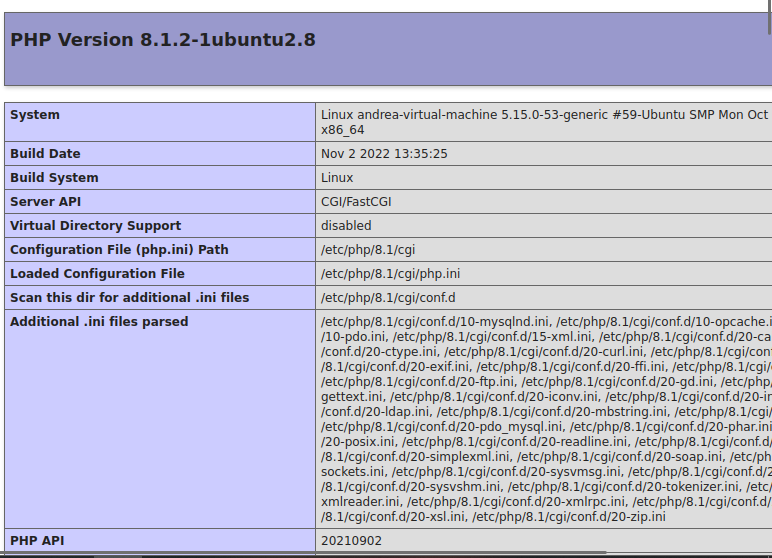
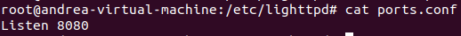
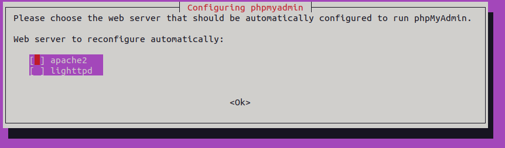
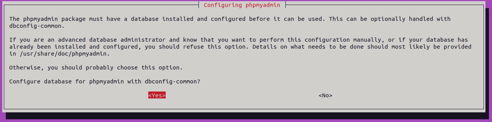
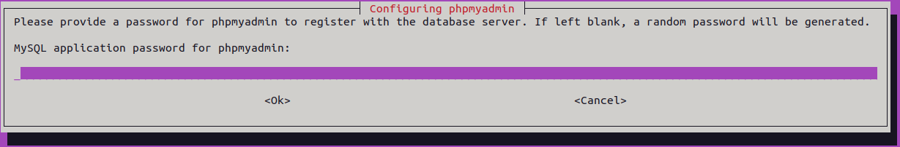
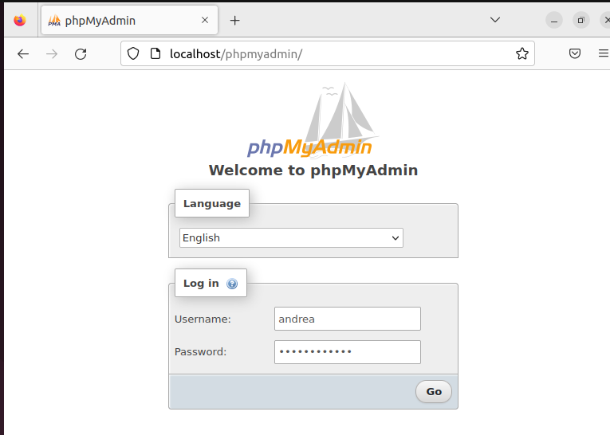
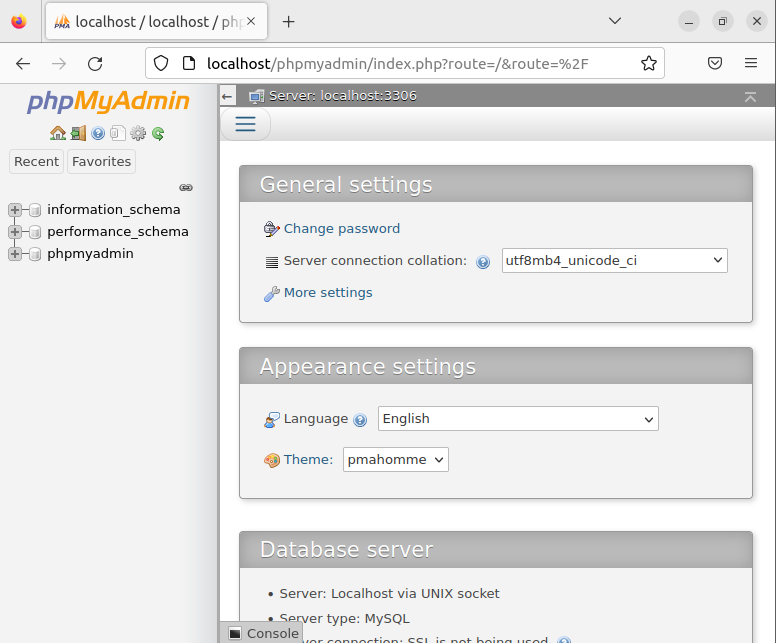

<h2>Instala un segundo servidor (lighttpd) bajo el dominio “servidor2.centro.intranet”. Debes configurarlo para que sirva en el puerto 8080 y haz los cambios necesarios para ejecutar php. Instala phpmyadmin.
</h2>

Primero, actualizo el sistema:

```apt-get update -y```

Para instalar Lighttpd uso:

```apt-get install lighttpd -y```

Finalizada la instalación, inicio el servidor: 

```sudo service lighttpd start```

Verifico el estado de Lighttpd con: 

```systemctl status lighttpd```

Todos los archivos de configuración de Lighttpd están dentro del directorio /etc/lighttpd. Podemos listarlos con: ```tree /etc/lighttpd/```

Debemos tener instalados los paquetes necesarios para habilitar el soporte de PHP y MySQL.  Se hace con: ```apt-get install php php-cgi php-mysql mysql-server -y```

Instalados, habilito el módulo FastCGI con:

```lighty-enable-mod fastcgi```
```lighty-enable-mod fastcgi-php```
Reiniciamos: 
```service lighttpd force-reload``` para aplicar la configuración.

Antes de acceder a la interfaz web de Lighttpd, crearemos el dominio ‘servidor2.centro.intranet’: 

```nano /var/www/html/servidor2.centro.intranet.php```

Dentro añadimos: <?php phpinfo(); ?> (por ejemplo, solo para visualizar que funciona, pero podemos añadir lo que queramos)

A continuación, en el navegador web, accedo al archivo servidor2.centro.intranet.php: 

```localhost/servidor2.centro.intranet.php. ```

Saldrá la siguiente página PHP:



En la página anterior hemos comprobado que la compatibilidad con PHP está habilitada en el servidor web Lighttpd.
Para configurar el servidor lighttpd para que sirva en el puerto 8080, haremos lo siguiente:

Voy a los ficheros de configuración:

```cd etc/lighttpd```
```sudo nano ports.conf```

Dentro escribimos: 

```Listen 8080```

Comprobamos que se ha guardado con ```cat ports.conf```



Reiniciamos con ```service lighttpd restart```

Ya estaría.


<h2>Instalar phpmyadmin: </h2>

Desactivamos el servidor y activamos Apache2 para instalar phpmyadmin.
```sudo service lighttpd stop```
```sudo service Apache2 start```

Actualizamos el servidor Apache:

```sudo apt update```

Instalamos phpmyadmin con el siguiente comando:

```sudo apt install phpmyadmin php-mbstring php-zip php-gd php-json php-curl```

Hecho esto, pedirá seleccionar un servidor web. Selecciono apache2:



Luego pedirá una configuración de base de datos. Seleccionamos 'Sí':



Deberemos establecer una contraseña de aplicación MySQL para phpmyadmin. En mi caso será "superpassword".



Una vez instalado phpMyAdmin debemos configurarlo con Apache para poder acceder a la interfaz web. Para ello:


* Copiamos el phpmyadmin.conf de nuestra instalación al directorio conf-available de Apache2:

```sudo cp /etc/phpmyadmin/apache.conf  /etc/apache2/conf-available/phpmyadmin.conf```

* Activamos la configuración:

```sudo a2enconf phpmyadmin```

* Reiniciamos Apache2 para guardar los cambios:

```sudo service apache2 restart```

Hecho todo esto, iremos al navegador y pondremos: http://localhost/phpmyadmin para iniciar sesión.



Inicio sesión con usuario phpmyadmin y contraseña superpassword. 

Nos saldrá lo siguiente:


